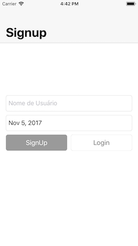
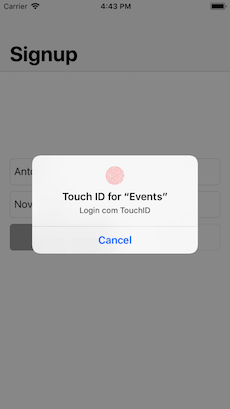
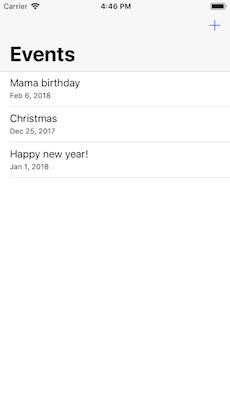

# Events-iOS

An iOS app that lets you register Events.

---- 

## Screenshots 
 
 
 
 

## Features
- Authentication with TouchID
- Register events locally
- Register events to iCloud Calendar

## Requirements
1. Xcode 9.
2. Swift 4.
3. Cocoapods version `1.3.1`
4. [SwiftLint](https://github.com/realm/SwiftLint) version `0.23.1`

## Getting Started
1. Clone this repository
2. Run `pod install`
3. Run project 🎉

## Architecture

This app conforms to [**MVVM** (Model-View-ViewModel)](https://en.wikipedia.org/wiki/Model%E2%80%93view%E2%80%93viewmodel) Patter and was implemented using Swift 4.

### Dependencies
> All of dependencies and third libraries used in this project as well as its versions can be found in [Podfile](https://github.com/antonyalkmim/Events-iOS/blob/master/Podfile).

- [RxSwift](https://github.com/ReactiveX/RxSwift) for binding views and reactive code
- [Moya](https://github.com/Moya/Moya) for networking
- [RealmSwift](https://github.com/realm/realm-cocoa) as database
- [IQKeyboardManagerSwift](https://github.com/hackiftekhar/IQKeyboardManager) to prevent keyboard overlaping fields
- [Quick](https://github.com/Quick/Quick) for tests
- [Nimble](https://github.com/Quick/Nimble) to tests assets

## TODO

- [ ] Remove `IQKeyboardManagerSwift` dependency
- [ ] Add more tests
- [ ] Add UI tests
- [ ] Add L10n
- [ ] Add A11n
- [ ] Add any CI

# License
----

MIT
